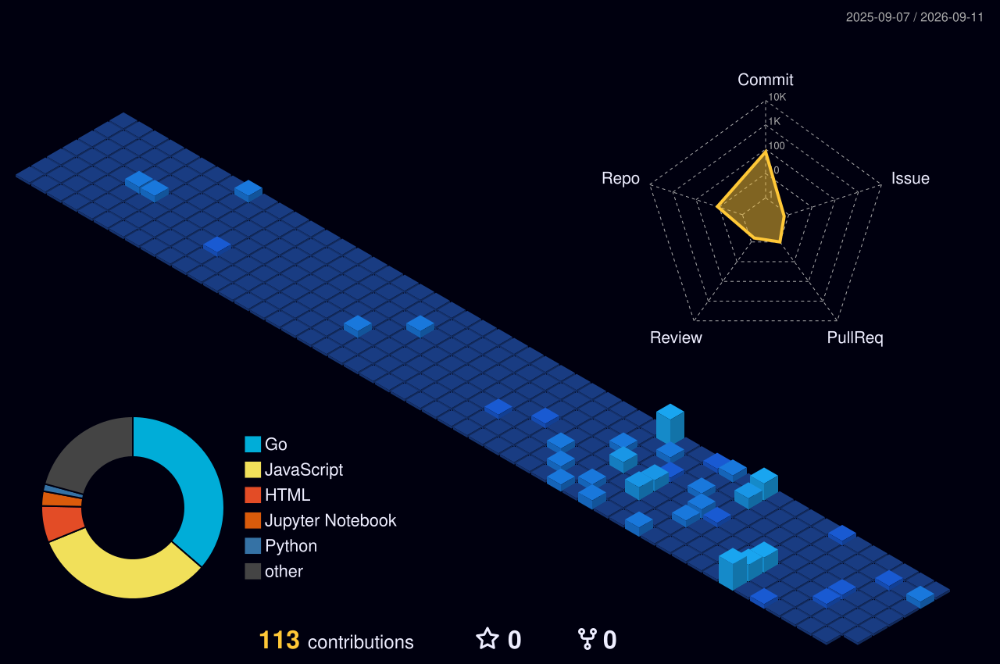

# 🌌 Sujal Parab

*Engineering highly scalable backend infrastructure, concurrent systems, and AI models.*

---

### 🛰️ Core Engineering Stack

  

### 🚀 High-Performance Projects

*   **Go AI Game Engine:** A highly optimized 9x9 Go game engine. The robust backend server is written entirely in Golang, utilizing the Alpha-Beta Pruning algorithm for intelligent, high-speed decision-making.
*   **Concurrent URL Status Checker:** A blazing-fast URL validation tool built with Go. Replaces sequential checking with high-throughput concurrent processing using `goroutines`, channels, and `sync.WaitGroup`.
*   **Finance Machine Learning Model:** A Python-based ML project focused on financial data processing and predictive analysis. 
*   **Student Database REST API:** A robust backend architecture built with Express and MongoDB for seamless student data management.

### 🌐 The 3D Contribution Matrix

---

  📫 <b>Looking for Summer 2026 Internships in Backend / Software Engineering</b>

